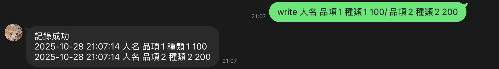
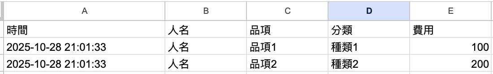
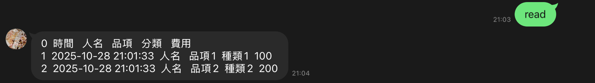
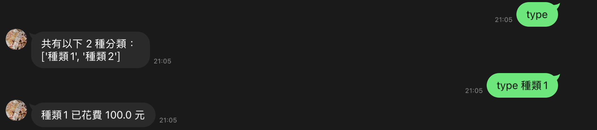
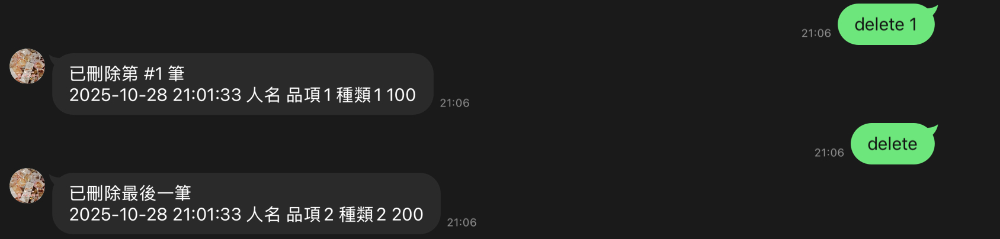
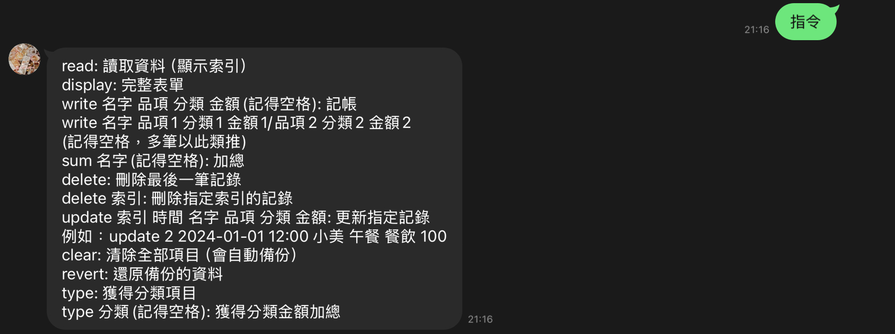

# Accounting LineBot - Line記帳機器人

>* 這是一個用 Python Flask、串接 LineBot API (Webhook)、連結 Google Sheet 並部署在 GCP 的記帳機器人
>* 透過 LineBot 將帳目記錄在 Google 試算表, 並將函式部署雲端, 使用 Line 即可隨時輕鬆記帳

## Architecture Diagram 架構圖


## Prerequisites 使用環境
* 後端: [Python Flask](https://flask.palletsprojects.com/en/2.2.x/)
* 套件管理: [uv](https://docs.astral.sh/uv/)
* LineBot: [Line Developers](https://developers.line.biz/zh-hant/) Messaging API
* 雲端部署: [Google Cloud Platform](https://console.cloud.google.com/?hl=zh-tw)(GCP) Cloud Function
* 資料庫: [Google Sheet](https://docs.google.com/spreadsheets/create?hl=zh-TW)

## Usage example 使用範例

### write (支援多筆同時輸入)

> 記錄``人名``買了``品項`` (屬於``種類``) 的``花費`` 
```
write 人名 品項 種類 花費
```
> 記錄``人名``買了``品項1`` (屬於``種類1``) 的``花費1``、
> ``品項2`` (屬於``種類2``) 的``花費2``
```
write 人名 品項1 種類1 花費1/ 品項2 種類2 花費2
```




### read

> 讀取完整記帳內容
```
read
```



### display

> 顯示完整表單網址, 也可以進行修改
```
display
```


### sum

> 加總``人名``全部花費
```
sum 人名
```


### type

> 獲取所有分類項目
```
type
```
> 加總``分類``全部花費
```
type 分類
```


### delete

> 刪除最後一筆記帳
```
delete
```
> 根據 read 顯示的索引刪除特定筆數資料
```
delete 索引
```



### update

> 根據 read 顯示的索引更新特定筆數資料
```
update 索引 時間 名字 品項 分類 金額
```


### clear

> 清空全紀錄，會自動備份到備份工作表
```
clear
```


### revert

> 還原備份的資料
```
revert
```


### 指令

> 顯示所有``指令``
```
指令
```


## Authors 關於作者
* Author: **chchchuang**  
* Update: 2025-10-28  
* Contact: chchchuang@gmail.com
